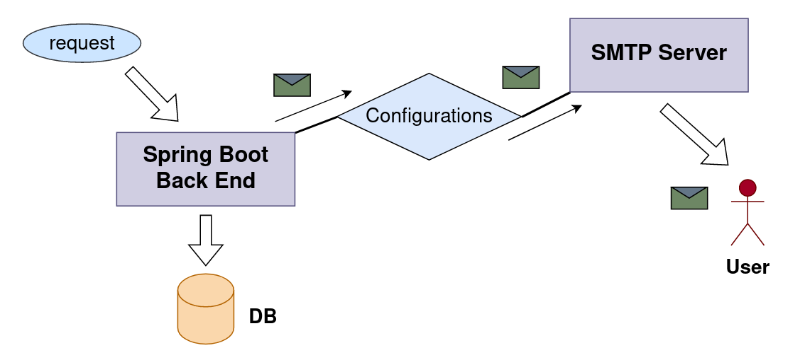
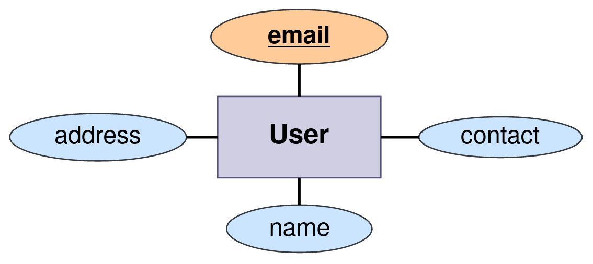

# Emailing With Spring Boot 

This project was developed using the **Spring Boot framework** with **n-tier architecture** to understand and improve on that
Knowledge of the **email sending feature** in Spring Boot.
In this project, **user web service** is exposed as an **API** under the **users** resource and more information on the user web 
service with example test cases can be found in the below API documentation.


Here, emails are sent to the appropriate users via a **third-party email service provider.** 
When a request comes to the **Spring Boot backend**, an email is sent from the **backend** to the appropriate user with the help of this email service provider. 
**(SMTP server)**

In this project, when the **user is saved** in the database, an email will be sent to the email address that comes from the **request JSON.**
The **working procedure** of the email sending function is shown in the following diagram.

<br>

**SendInBlue's SMTP server** will be used as the email service provider for this project. 
It is required to **create an account** at [**SendInBlue**](https://www.sendinblue.com/?utm_source=adwords_brand&utm_medium=lastclick&utm_content=SendinBlue&utm_extension&utm_term=sendinblue&utm_matchtype=e&utm_campaign=1153673712&utm_network=g&km_adid=355470527172&km_adposition&km_device=c&utm_adgroupid=53093595276&gclid=CjwKCAjw0N6hBhAUEiwAXab-TVawnuSLp00WSq8hvJ7B1pJ4pnyqHwjoNrTyuVkvpyyA2G1ziC302RoCt3kQAvD_BwE) and after creation go to the **SMTP & API 
section** and get the **SMTP server**, **port**, **login email** and **master password.** These details should be used in the `application.properties` resource bundle as below.

```
spring.mail.host=SMTP Server
spring.mail.port=port
spring.mail.username=login email
spring.mail.password=master password
```

#### Highlighted features of the application,

- When the user is saved in the database, an email is sent from the Spring Boot backend to the user's email address.

#### Few snapshots of the documentation

- Transaction got rolled back.<br>


#### ERD of the database



## Used Technologies

- Java SE 11
- Spring Boot 2.7.8
- Apache Maven 3.8.6
- MySQL Community Server 8.0.31
- Added dependencies to pom.xml
    - spring-boot-starter-web 2.7.8
    - spring-boot-starter-validation 2.7.8
    - spring-boot-starter-data-jpa 2.7.8
    - spring-boot-starter-aop 2.7.8
    - spring-boot-starter-mail 2.7.8
    - spring-boot-starter-test 2.7.8
    - spring-boot-devtools
    - lombok 1.18.24
    - mysql-connector-j 8.0.31
    - modelmapper 3.1.0

#### Used Integrated Development Environment
- IntelliJ IDEA

## How to use ?
This project can be used by cloning the 
project to your local computer.

Make sure to create a **user_app_db** database in the MySQL community server.
If neglect to create, the project will automatically generate it when it is firstly executed.

#### Clone this repository
1. Clone the project using `https://github.com/PubuduJ/emailing-with-spring-boot.git` terminal command.
2. Open the `pom.xml` file from **IntelliJ IDEA**, make sure to open this as a project.
3. Change the `spring.datasource.password` in the `application.properties` to your local machine MySQL server password.
4. Give the values for `spring.mail.host`, `spring.mail.port`, `spring.mail.username` and `spring.mail.password` in the `application.properties` from your `Sendinblue` **SMTP Server** account.

## Version
v1.0.0

## License
Copyright &copy; 2023 [Pubudu Janith](https://www.linkedin.com/in/pubudujanith/). All Rights Reserved.<br>
This project is licensed under the [MIT license](LICENSE.txt).